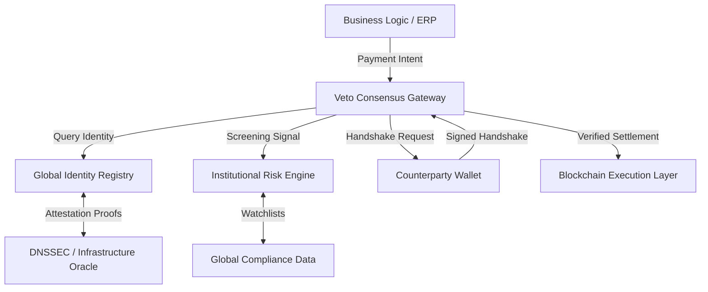
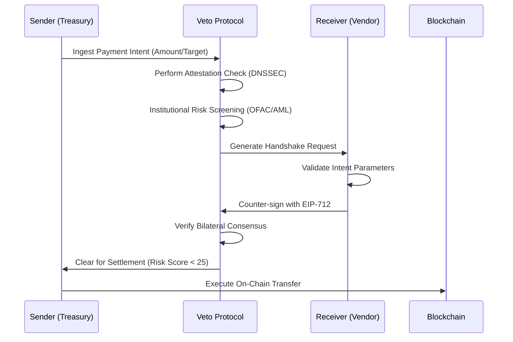

# Architecture & Protocol Design

Veto is architected as a **High-Availability Integrity Layer** that sits between the business logic and the blockchain execution layer. Our design follows a **Shadow-Security** model, where every transaction is validated in a parallel, non-blocking environment before being cleared for settlement.

## System Overview

The Veto ecosystem consists of four primary technical components:

1.  **Identity Oracle**: A specialized service that monitors DNSSEC and web-based infrastructure to maintain the Global Registry.
2.  **Consensus Gateway**: An API-driven protocol handler that manages the bilateral handshakes and EIP-712 signature verification.
3.  **Risk Aggregator**: A real-time data pipeline that ingest signals from global sanctions lists and on-chain behavioral models.
4.  **Integration SDKs**: Developer tools that allow enterprises to embed Veto directly into their existing Treasury and ERP workflows.

## The Verification Lifecycle

When an organization initiates a payment, Veto executes the following high-level sequence:

1.  **Capture**: The system ingests payment intent (via API scan or Manual Document Upload).
2.  **Attestation Check**: Veto queries the **Identity Registry** to ensure the destination wallet is cryptographically anchored to a verified counterparty domain.
3.  **Bilateral Consensus**: The system generates a Veto Handshake. The recipient must counter-sign this intent to prove their active participation and wallet control.
4.  **Institutional Approval**: The transaction is cleared for execution only once all identity, risk, and consensus requirements are satisfied (Risk Score < threshold).

## Cryptographic Standards

Veto utilizes industry-standard cryptographic primitives to ensure that trust is verifiable, not assumed:

*   **EIP-712 (Typed Data Signing)**: Ensuring that signatures are human-verifiable and specifically scoped to a unique transaction 'intent'.
*   **DNSSEC (Domain Name System Security Extensions)**: Anchoring digital identities to the global DNS root of trust.
*   **Ed25519 / Secp256k1**: Support for multiple curve-based signature schemes to bridge compatibility between Ethereum (EVM) and non-EVM chains (like Solana/Stellar).

## Data Privacy & Sanitization

Veto is designed for enterprise privacy requirements. While transaction *metadata* (amounts/identities) is used for verification, the system supports a **Sanitized Audit Trail**. Sensitive PII (Personally Identifiable Information) can be hashed or stored in restricted, SOC2-compliant enclaves, ensuring that the public registry remains a list of *verified identities* without exposing internal business secrets.
